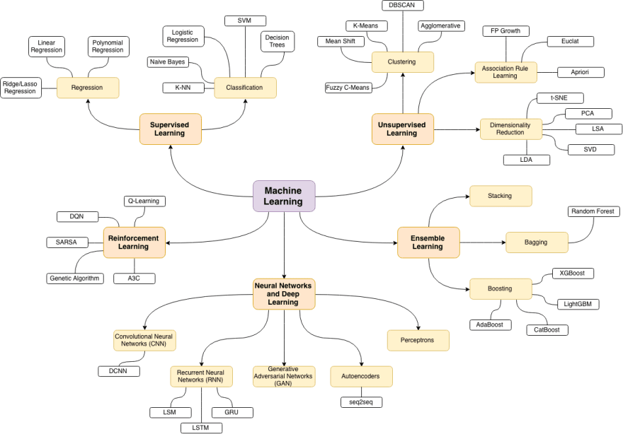

### Giriş

***Maşın öyrənməsinin qısaca təsnifatı***

_Maşın öyrənməsi məlumatlardan biliyin əldə edilməsidi. Statistika, süni intellekt və kompüter elminin kəsişməsinin tədqiqat sahəsidir və həmçinin proqnozlaşdırıcı analitik və ya statistik öyrənmə kimi tanınır. Son illərdə maşın öyrənmə metodlarının tətbiqi gündəlik həyatda hər yerdə olur. Hansı filmlərin seyr ediləcəyi,hansı yeyəcəklərin sifariş veriləcəyi və ya hasnı məhsulların alınacağına,fotoşəkillərinizdəki dostlarınızı tanımağa avtomatik tövsiyələr verən,bir çox müasir veb-saytlar və qurğularn özlərində maşın öyrənmə alqoritmləri vardır. Facebook, Amazon və ya Netflix kimi kompleks bir veb səhifəyə baxdığınızda, saytın hər bir hissəsində bir çox maşın öyrənmə modelləri vardır._

_Maşın öyrənməsi məlumatları araşdırmaq üçün riyazi modellər inşa etməklə məşğuldur.
"Öyrənmə" vəzifələri bu modellərdə özəlləştirilə bilən parametrlərin görünüşü ilə başlayır bu müşahidə olunan məlumatları əks etdirmək üçün düzəliş edilə bilər, buna görə də proqram məlumatlardan öyrənir.Bu vasitələrdən səmərəli istifadə etmək üçün, maşın öyrənmə probleminin ümumi formulunu anlamaq lazımdır. Maşın öyrənməsinin müxtəlif növləri vardır və bəzilərini qeyd edirəm:_

 

1 Nəzarətli öyrənmə (supervised learning)

* Siniflənfirmə

      K-Nearest Neighbours
      Naive Bayes          
      Decision Tree      
      Random Forest      
      Support Vector Machine
      

* Reqressiya 

      Linear Regression
      Logistic Regression
      Multiple Linear Regression
      Polynomial Regression
      Support Vector Regression
      Decision Tree

2 Nəzarətsiz öyrənmə (unsupervised learning)

* Kümələmə (Clustering)

      K-Means

* Birlik Qaydası (Association Rule Mining )

      Apriori algorithm    
      Eclat algorithm    
      FP-growth algorithm
    

* Ölçü Azaltma (Dimensionality Reduction)

      PCA (Principal Component Analysis)

3 Qüvvətləndirməli öyrənmə (reinforcement learning)

        Q-Learning technique
        State-Action-Reward-State-Action (SARSA)
        Deep Q Network (DQN)
        Deep Deterministic Policy Gradient  (DDPG)

4 Neural Network (NN)

        Multilayer Perceptron (MLP) 

_Maşın öyrənməsinə başlamaq üçün bunları terminaldan yükləmək lazımdır `pip3 install numpy scipy matplotlib ipython scikit-learn pandas seaborn`_
